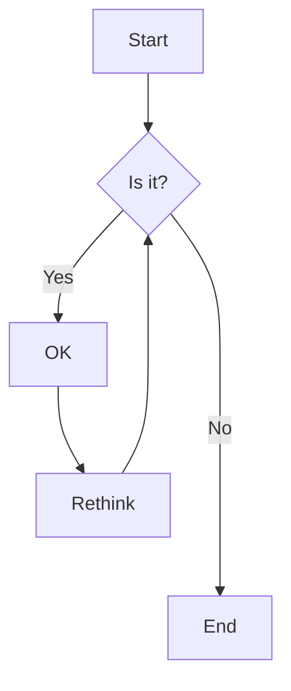
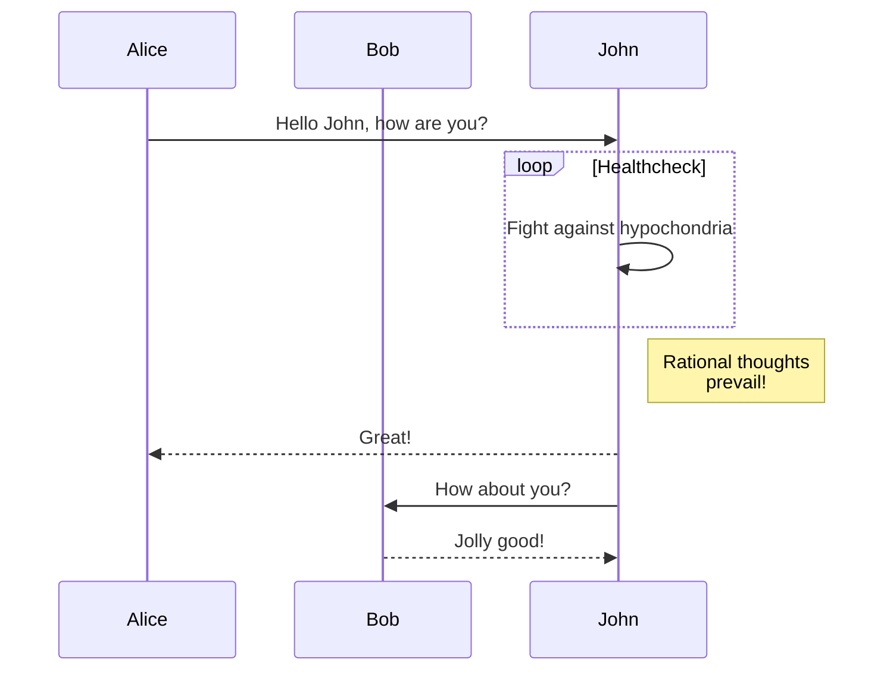
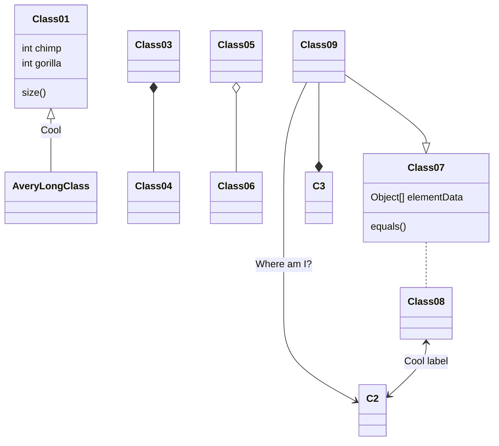

# Diagrams and Special Markdown Features

## Mermaid Diagrams

GitHub supports Mermaid diagrams in markdown:

### Sequence Diagram

### Class Diagram

## Math Expressions

GitHub also supports mathematical expressions using LaTeX syntax:

When $a \ne 0$, there are two solutions to $ax^2 + bx + c = 0$ and they are
$$ x = {-b \pm \sqrt{b^2-4ac} \over 2a} $$

Inline math: $E=mc^2$

## GitHub-specific Features

### Internal Linking to Headers

[Link to the Math Expressions section](#math-expressions)

### Relative Links

[Link to the basic.md file](basic.md)
[Link to the code examples](code-and-links.md#code)

### Keyboard Shortcuts

<kbd>Ctrl</kbd>+<kbd>C</kbd>: Copy
<kbd>Ctrl</kbd>+<kbd>V</kbd>: Paste